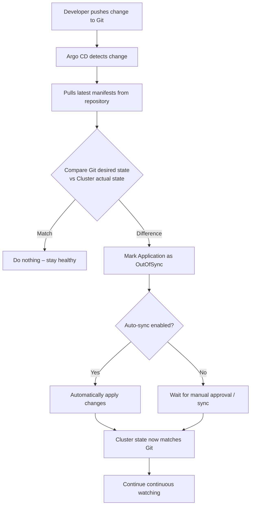
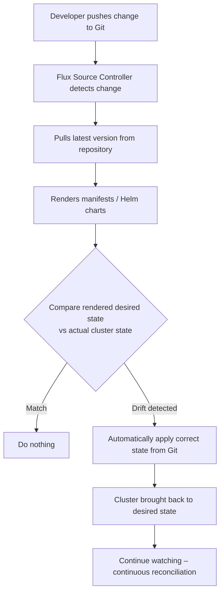

# GitOps Detailed Notes

> **Source**: Video by Vishaka (Senior Solutions Architect)  
> **Topic**: GitOps – The Next Evolution of CI/CD  
> **Audience**: DevOps Engineers, Platform Engineers, and teams working with Agentic / AI systems  
> **Focus**: Conceptual understanding, traditional CI/CD bottlenecks, push vs pull model, Kubernetes setup with Argo CD & Flux CD, benefits, and scenario-based questions.

---

## 1. Introduction

GitOps is increasingly regarded as the natural next step after traditional CI/CD.  

It is relevant not only for classic DevOps and Platform Engineering roles, but also for teams building and operating **agentic systems and AI applications**.  

In AI environments, model versions, inference services, prompt configurations, embedding pipelines, and API endpoints change frequently. GitOps brings structure, auditability, and reproducibility to these rapidly evolving systems.

This notes document covers:

- What GitOps actually means
- Why it became popular
- Traditional CI/CD workflow and its limitations
- How GitOps changes the model (push → pull)
- Setting up GitOps on Kubernetes (Argo CD and Flux CD)
- Comparison of the two popular operators
- Key benefits
- Scenario-based interview / practical questions
- Final recap

---

## 2. What is GitOps?

**GitOps means using Git (the version control system) as the single source of truth for both applications and infrastructure.**

Instead of saying “I deployed this manually” or “the CI pipeline pushed this change”, GitOps says:

> “Whatever is currently declared in Git is exactly what the cluster **should** look like.”

### What lives in Git under GitOps?

| Item                        | Description                                      |
|-----------------------------|--------------------------------------------------|
| Kubernetes Manifests        | Deployments, Services, ConfigMaps, Ingress, etc. |
| Helm Values                 | Environment-specific configuration               |
| Environment Variables       | Non-sensitive configuration                      |
| Secret references / sealed secrets | Sensitive data handled carefully             |
| Application Versions        | Container image tags / digests                   |
| Infrastructure definitions  | When using tools that support declarative infra  |

Git becomes the **central control plane** for the entire system.

### Is GitOps only for Kubernetes?

**No.**

Kubernetes is the most popular platform for GitOps because it is declarative by design (desired state is expressed in YAML and the control plane continuously reconciles).  

However, **any platform that follows the Open GitOps principles** can implement a GitOps approach. The core idea is platform-agnostic; Kubernetes simply makes it natural and mature.

---

## 3. Why Did GitOps Become Popular?

The fundamental problem GitOps solves:

> How do you keep deployments consistent when the system is changing continuously?

### Key reasons for popularity

1. **Every change is tracked**  
   Every modification has a Git commit. Even when an AI coding assistant co-authors the change, the commit history remains clear.

2. **Full accountability**  
   You always know *who* changed *what* and *when*.

3. **Exact reproducibility**  
   Any environment (dev, staging, production, or a brand-new cluster) can be recreated from the same Git repository.

4. **Simple and reliable rollback**  
   If something breaks, rolling back is as simple as reverting a Git commit. The GitOps controller then brings the cluster back to the previous desired state.

5. **Perfect fit for AI / ML systems**  
   AI teams frequently change:
   - Model versions
   - Inference service configurations
   - Prompt templates
   - Embedding pipelines
   - API configurations  

   GitOps gives these frequent changes structure, versioning, and a complete audit trail.

---

## 4. Traditional CI/CD vs GitOps

### 4.1 Traditional CI/CD Workflow (Push-based)

```
Developer → Code Push
     ↓
CI Pipeline (GitHub Actions / Jenkins / GitLab CI)
     ├── Install dependencies
     ├── Run tests
     ├── Build container image
     ├── Scan image (Trivy / Grype)
     ├── Push image to registry
     └── Connect to cluster and deploy (kubectl / helm / etc.)
```

**Characteristics of the push model:**

- The CI/CD system holds credentials with powerful permissions on the cluster.
- After every successful build, the pipeline **actively pushes** changes into the production (or target) cluster.
- This is called **push-based deployment**.

**Problems with this approach:**

| Problem                          | Explanation                                                                 |
|----------------------------------|-----------------------------------------------------------------------------|
| Security risk                    | CI system has direct, high-privilege access to production. If the pipeline is compromised or misconfigured, an attacker has a direct path to production. |
| No drift detection               | If someone makes a manual change in the cluster (e.g., `kubectl edit` or `kubectl delete`), the system does not know and does not correct it. |
| Audit gaps                       | Manual changes leave no clear trail of *who* did *what*.                    |
| Tight coupling of CI and CD      | The same system that builds also deploys. Separation of concerns is weak.   |

Common tools powering traditional CI/CD: **GitHub Actions, Jenkins, GitLab CI**.

### 4.2 GitOps Workflow (Pull-based)

The Continuous Integration part looks almost identical at the beginning, but it **stops before deployment**.

```
Developer → Code Push
     ↓
CI Pipeline (GitHub Actions / Jenkins / GitLab CI)
     ├── Install dependencies
     ├── Run tests
     ├── Build container image
     ├── Scan image (Trivy / Grype)
     ├── Push image to registry
     └── Update a separate Git Config Repository (desired state)
           ↓
GitOps Controller (Argo CD or Flux) running *inside* the cluster
     ├── Continuously watches the Config Repository
     ├── Detects change
     ├── Pulls the new desired state
     └── Applies it to the cluster
```

**Key differences:**

- CI only owns the **build** stage.
- The GitOps controller (Argo CD / Flux) owns the **deployment** stage.
- The cluster itself pulls its desired state from Git.
- This is called **pull-based deployment**.

### 4.3 Side-by-Side Comparison

| Aspect                    | Traditional CI/CD (Push)                          | GitOps (Pull)                                      |
|---------------------------|---------------------------------------------------|----------------------------------------------------|
| Who initiates deployment? | CI pipeline actively connects and pushes          | Cluster (via controller) pulls from Git            |
| Credentials location      | CI system holds cluster credentials               | Cluster holds read access to Git repo              |
| Security posture          | Higher risk (external system has prod access)     | More secure (cluster never exposes write access externally) |
| Drift detection           | Usually absent                                    | Built-in – controller detects and can auto-heal    |
| Source of truth           | Ambiguous (pipeline + manual changes)             | Git is the single source of truth                  |
| Rollback                  | Re-run pipeline or manual intervention            | Simple `git revert` + automatic reconciliation     |
| Auditability              | Incomplete if manual changes occur                | Complete (every change has a commit)               |
| CI / CD coupling          | Tightly coupled                                   | Fully decoupled                                    |

### 4.4 Visual Workflow Comparison (Mermaid)


**Critical takeaway**:  
In the pull model the cluster never exposes deployment credentials to any external system. If someone changes the cluster directly, the GitOps controller detects the drift and (depending on configuration) either alerts or automatically restores the state declared in Git.

---

## 5. GitOps Setup on Kubernetes

One of the strongest advantages of GitOps is **repeatability**:

- Lose a cluster? Rebuild it from Git.
- Need a new environment? Point a new cluster at the same repository.

Two dominant Kubernetes-native GitOps operators exist:

| Operator   | Focus                              | UI by default | Style          |
|------------|------------------------------------|---------------|----------------|
| **Argo CD**    | Visibility + Control               | Yes           | Application-centric |
| **Flux CD**    | Automation + Self-healing          | No (CLI/API)  | Modular controllers |

Both follow the same core principle: **watch Git → reconcile the cluster**.

### 5.1 Argo CD Setup & Workflow

**Installation (high-level)**  
- Add the Argo CD Helm repository  
- Install the Argo CD operator via Helm  
- It runs several pods: API Server, Application Controller, Repo Server, etc.

**Key object**: `Application` (Custom Resource)  
This CR tells Argo CD:
- Which Git repository to watch
- Which path inside the repository
- Which Kubernetes namespace to deploy into

**Argo CD Reconciliation Loop**



**Key behaviours**:
- Continuous comparison between desired (Git) and actual (cluster) state.
- Optional automatic sync or manual approval gate.
- Clear visual status in the Argo CD UI (Synced / OutOfSync / Healthy / Degraded).

### 5.2 Flux CD Setup & Workflow

Flux is more **modular**. There is no default web UI; everything is managed via Custom Resources and controllers.

**Core controllers (installed via Helm or flux CLI)**:

| Controller              | Responsibility                                      |
|-------------------------|-----------------------------------------------------|
| **Source Controller**   | Watches Git repos, Helm repos, OCI registries, etc. |
| **Kustomize Controller**| Takes artifacts and applies raw YAML / Kustomize    |
| **Helm Controller**     | Manages Helm releases                               |

**Typical Flux objects**:
1. `GitRepository` CRD → “This is the source repository”
2. `Kustomization` or `HelmRelease` CRD → “This is what to deploy and where”

**Flux Reconciliation Loop**



**Key characteristics of Flux**:
- Strong emphasis on automation and self-healing.
- Highly composable (you only install the controllers you need).
- Excellent for GitOps at scale and multi-tenancy patterns.

### 5.3 Argo CD vs Flux CD – Summary

| Dimension              | Argo CD                                      | Flux CD                                      |
|------------------------|----------------------------------------------|----------------------------------------------|
| Primary strength       | Visibility, control, rich UI                 | Automation, modularity, self-healing         |
| User interface         | Excellent web UI out of the box              | No default UI (CLI / API / dashboards)       |
| Architecture           | More monolithic application model            | Collection of independent controllers        |
| Learning curve         | Easier for teams that want a GUI             | Steeper, more “Kubernetes-native” feel       |
| Multi-tenancy          | Good with Projects                           | Excellent native support                     |
| Community & CNCF       | CNCF Graduated                               | CNCF Graduated                               |
| Typical choice         | Teams that value observability & control     | Teams that value pure automation & GitOps purity |

Both are production-grade and widely used. Choice depends on team culture and operational preferences.

---

## 6. Benefits of GitOps

| # | Benefit                              | Explanation                                                                 |
|---|--------------------------------------|-----------------------------------------------------------------------------|
| 1 | Complete change history              | Every modification lives in Git with full commit metadata                   |
| 2 | Simple, reliable rollback            | `git revert` + controller automatically restores previous state             |
| 3 | Single source of truth               | All environments stay consistent because they all read from the same Git    |
| 4 | Drift detection & self-healing       | Controller continuously compares and can automatically correct deviations   |
| 5 | Disaster recovery                    | Lost a cluster? Recreate it purely from the Git repository                  |
| 6 | Auditability for AI systems          | Model versions, prompts, inference configs become versioned and reviewable  |

These benefits become especially valuable when dealing with AI applications where configuration and model artifacts change frequently.

---

## 7. Scenario-Based Questions (Practical Understanding)

These questions test whether you truly understand the GitOps model.

### Scenario 1
A developer changes the Docker image version in Git from `v1` to `v2`.  
**What happens next when Argo CD is in the picture?**

**Answer**:  
Argo CD detects the Git change, pulls the updated manifests, compares them with the live cluster, and (if auto-sync is enabled) applies the newer image version to the Kubernetes Deployment. The cluster converges to the new desired state.

### Scenario 2
Someone manually edited a Kubernetes Deployment using `kubectl edit`.  
**What happens?**

**Answer**:  
The GitOps controller (Argo CD or Flux) detects configuration drift because the live state no longer matches Git.  
If self-healing / auto-sync is enabled, the controller restores the state defined in Git, overwriting the manual change.

### Scenario 3
Production breaks after a bad release.  
**What is the GitOps way of fixing it?**

**Answer**:  
Revert the Git commit that introduced the bad state.  
The GitOps controller will detect the revert and automatically sync the cluster back to the previous healthy desired state. No need to manually run `kubectl` or re-trigger a pipeline for rollback.

### Scenario 4
GitHub Actions has just built a new container image.  
**Should the CI system deploy directly to Kubernetes in a GitOps setup?**

**Answer**:  
**No.**  
In a proper GitOps model the CI system should **only** update the deployment configuration (image tag) in the Git config repository.  
The GitOps controller (Argo CD / Flux) is solely responsible for deploying the change into the cluster.

---

## 8. Recommended Next Steps (from the video)

1. Explore the **DevOps AI Playbook** repository mentioned in the video.  
   It demonstrates both:
   - Building a CI pipeline with GitHub Actions
   - Setting up a GitOps operator  
   You will see both the UI experience and automatic cluster synchronization.

2. Practice the core GitOps experience:  
   Make a change in Git → observe the cluster automatically converge to the new desired state.

3. Deepen understanding of the traditional CI/CD side by reviewing the related CI/CD video referenced by the speaker.

---

## 9. Final Recap

| Traditional CI/CD                          | GitOps                                      |
|--------------------------------------------|---------------------------------------------|
| Pipeline **pushes** deployments into infrastructure | Git stores the **desired state**            |
| External system has write access to cluster | Cluster **pulls** changes continuously      |
| Manual changes can go unnoticed            | Drift is detected and corrected             |
| Rollback is often complex                  | Rollback = `git revert`                     |

**GitOps flips the model**:  
Git becomes the single source of truth.  
The cluster continuously reconciles itself to match what is declared in Git.  
This gives you stronger security, full auditability, easier rollbacks, and true infrastructure-as-code discipline — especially valuable for modern AI and platform engineering workloads.

---

*Notes created strictly from the provided video transcript. All concepts, workflows, tool names, and scenario answers are grounded in the content delivered by Vishaka.*
