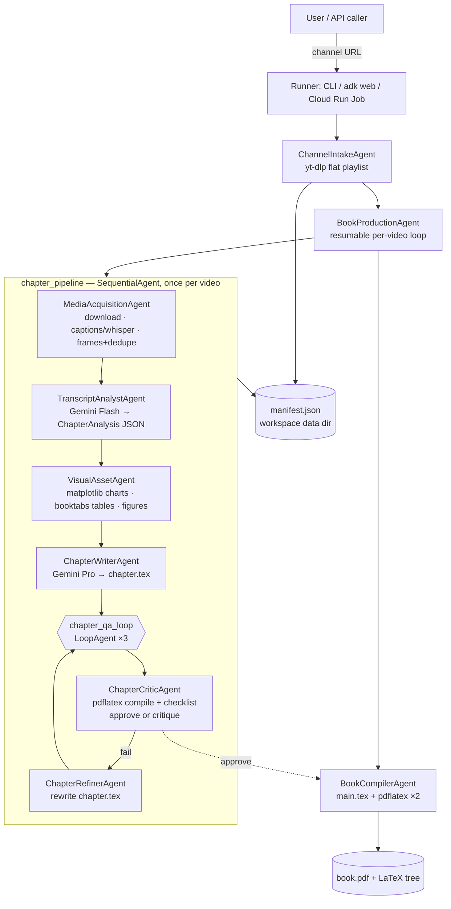

# Solution Architecture — BookForge (YouTube Channel → Book, Google ADK)

## Requirements (confirmed from brief)

- **Functional:** one YouTube channel URL in → one detailed book out; per-video
  chapters with notes, tables, charts, diagrams, screenshots; verify-and-refine
  loop per chapter; compile everything into a single PDF.
- **Non-functional:** resumable long-running batch (hours), per-video failure
  isolation, minimal token spend on deterministic steps, reproducible LaTeX
  build, containerized deployment, secret-free code.

**Design pattern:** multi-agent system (orchestrated pipeline) — the workload
has heterogeneous stages with different reliability/cost profiles, which a
single agent cannot serve well.

## Component → technology mapping

| Component | Technology | Why |
|---|---|---|
| Agent framework | Google ADK (Python) 2.x | `SequentialAgent`/`LoopAgent`/custom `BaseAgent` graph, session state, `output_schema` structured output |
| Reasoning models | Gemini 2.5 Flash (analyst/critic) + Gemini 2.5 Pro (writer) via `GOOGLE_API_KEY` (AI Studio) or Vertex AI | Flash for volume tasks, Pro for long-form writing |
| Channel/video acquisition | `yt-dlp` (Python API) | robust channel listing, downloads, caption fetch |
| Speech-to-text fallback | `faster-whisper` (local) | zero per-minute cost, offline-capable |
| Frame extraction | `ffmpeg` + `imagehash` (pHash) | deterministic dedupe + quality filters |
| Charts | `matplotlib` (Agg, PDF output) | vector figures from analyst's data spec |
| Typesetting | LaTeX (`pdflatex`, booktabs, TikZ, graphicx) | print-quality output the critic can *actually compile-verify* |
| Runtime (local dev) | `adk run` / `adk web`, `python -m bookforge.main` | ADK-native dev loop |
| Runtime (prod) | Cloud Run **Job** (long-running batch) — service alternative with async pattern noted | scale-to-zero, no request timeout issues for hours-long runs |
| Alt. managed runtime | Vertex AI Agent Engine (`adk deploy agent_engine`) | managed sessions for interactive use |
| Secrets | env vars / Secret Manager | never in code |
| Storage (prod) | workspace on local disk in dev; GCS bucket mount/sync in prod notes | artifacts outlive the container |

## Architecture diagram

## Design recommendations applied

- **Deterministic steps are code, not prompts** — download/frames/render/compile
  are custom `BaseAgent`s calling tested tool functions; LLMs only analyze,
  write, and critique.
- **Structured contracts between agents** — `ChapterAnalysis` (pydantic
  `output_schema`) is the single hand-off from understanding to typesetting.
- **Verify by execution** — the critic runs `pdflatex` and checks asset
  references instead of "reading" the chapter and guessing.
- **Bounded loops** — `max_iterations=3` + escalate-on-approve; no unbounded
  refinement spend.
- **Cost controls** — 480p downloads, captions before whisper, Flash for
  high-volume stages, frame curation caps images per chapter.
- **Security** — API key via env/Secret Manager only; `.env` git-ignored;
  no credentials in LaTeX artifacts (book-security note in README).
- **Observability** — structured logging per stage; ADK events surfaced by the
  CLI runner; Cloud Logging when deployed (see `deployment/README.md`).

## Validation strategy (phase 4 preview)

1. `pytest` — tool-level units (dedupe, manifest, vtt parsing, LaTeX render/compile, graph wiring).
2. `adk run bookforge` with a 1-video channel / `--max-videos 1` smoke run.
3. `adk eval` with `eval/bookforge.evalset.json`.
4. `gcloud run jobs execute` after `deployment/README.md` steps; check exit code + `book.pdf` artifact.
